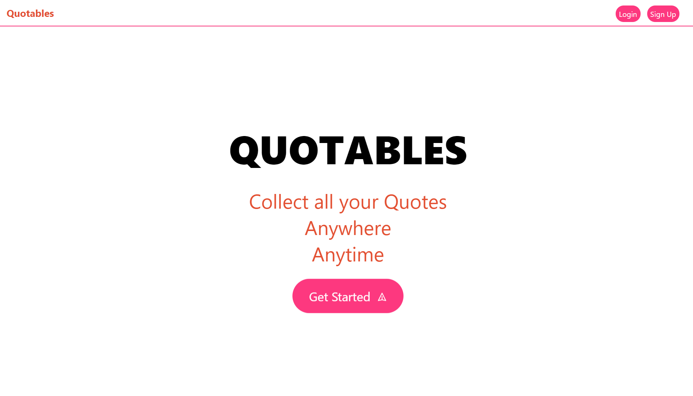
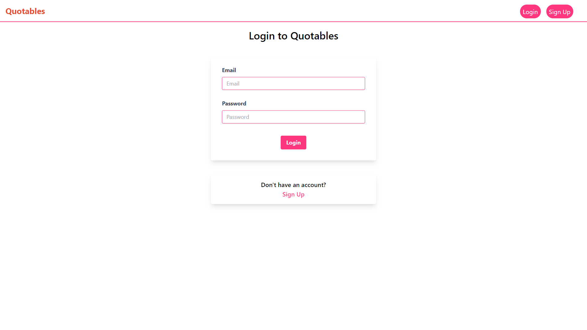
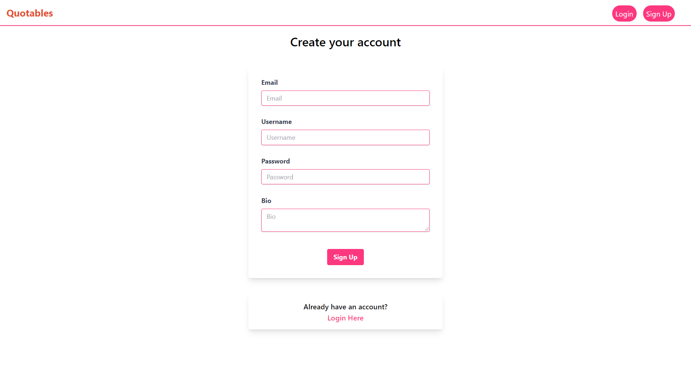
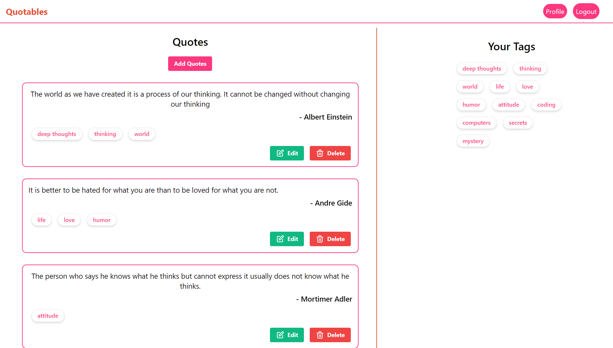
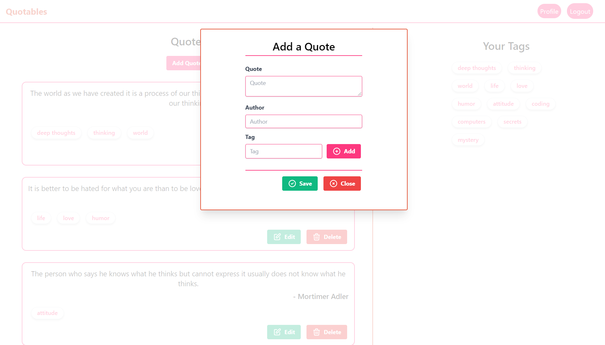
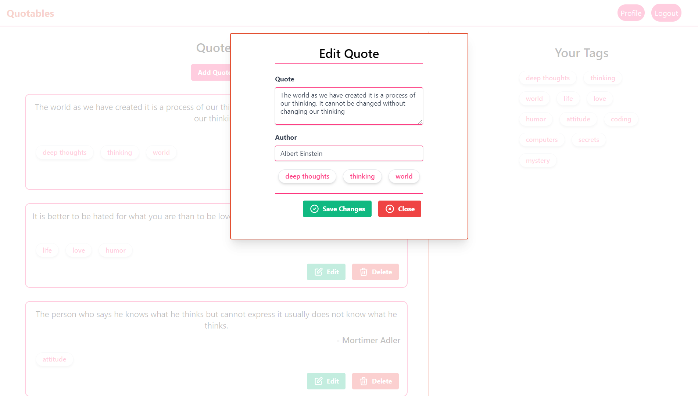
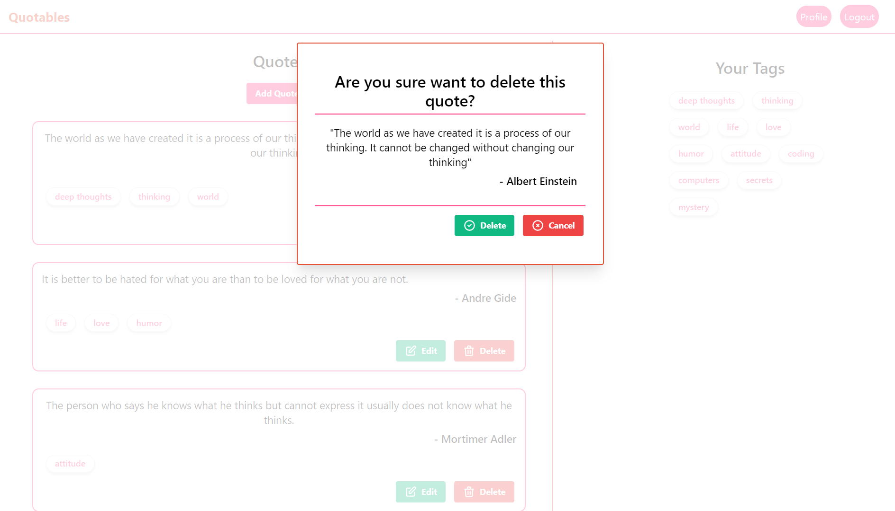
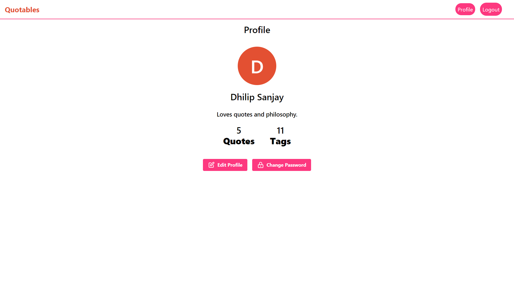

# Quotables
## Quotables - Collect you favourite quotes!
Everyone must have their own list of quotations because favourite quotes serve to define a person rather quickly, which helps others who resonate at the same frequencies realize that we share perspectives. But collecting quotes and maintaining it in a single platform is very difficult. **Quotables** being a web application, anyone can save their favourite quotes anytime, anywhere by just creating an account in the website. Therefore, a person may no longer waste his/her time in searching for his/her favourite quotes.

## Tech Stack
### Frontend
- React JS
- Tailwind CSS

### Backend
- PHP 
- MySQL

---
## Screenshots
### Home Page

### Login Page

### Sign Up Page

### Quotes Page

### Add Quote

### Edit Quote

### Delete Quote

### Profile Page

---

## References
- [React Documentation](https://reactjs.org/docs/getting-started.html)
- [PHP - Authorization using JWTs](https://www.sitepoint.com/php-authorization-jwt-json-web-tokens/)
- [Firebase - PHP JWT](https://github.com/firebase/php-jwt)

---